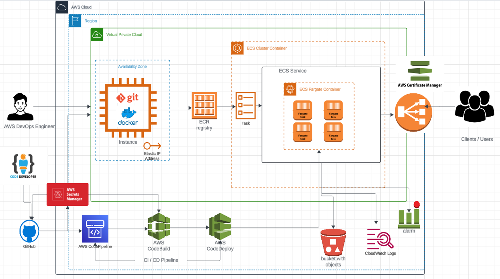
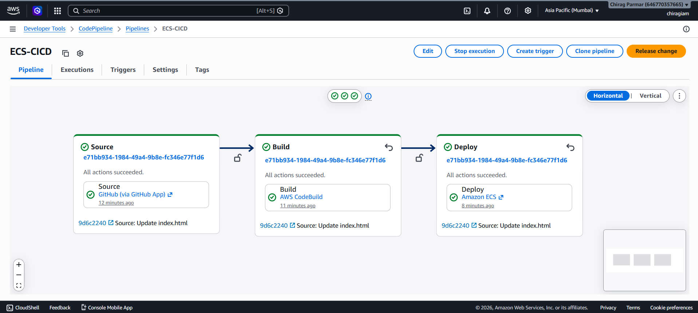
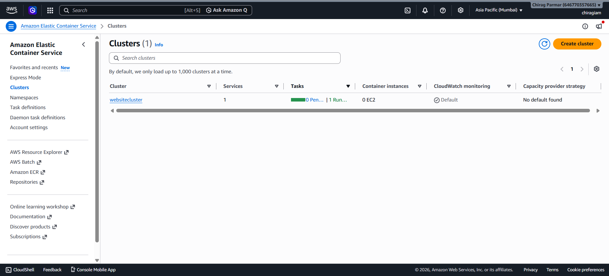
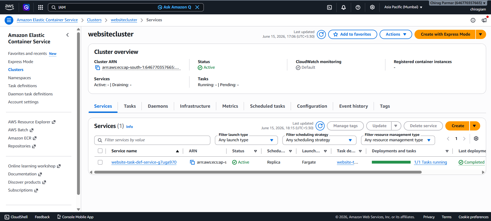
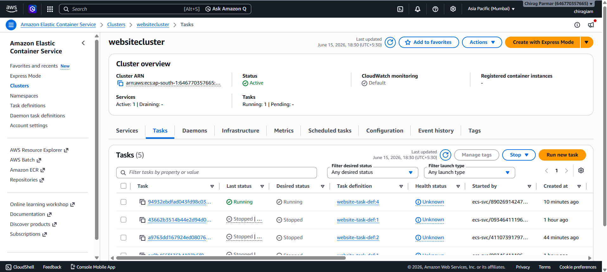
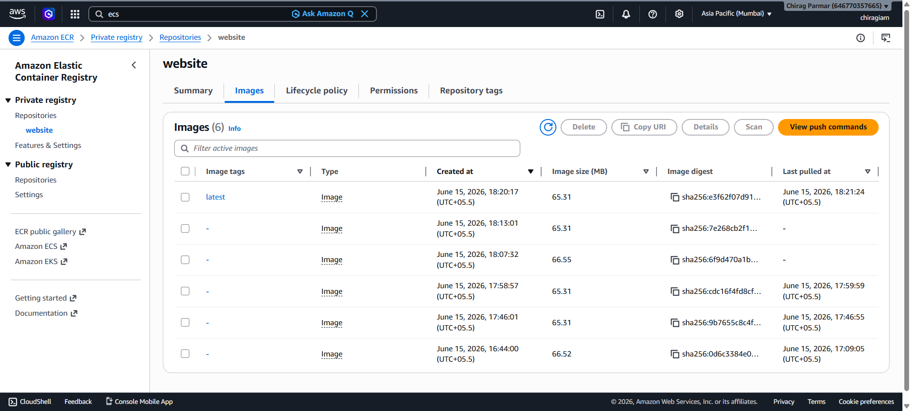
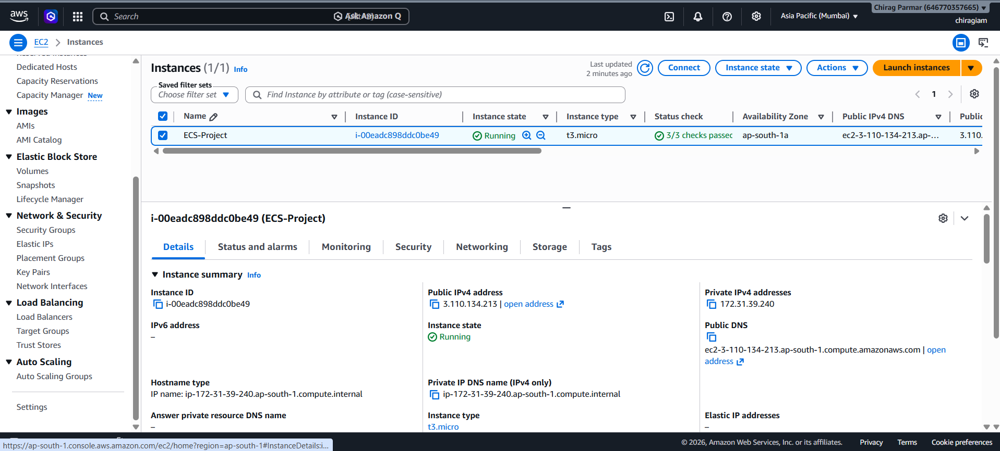

# 🚀 AWS DevOps CI/CD Pipeline — Containerized App Deployment on ECS

> **Auto-deploy on every Git commit** — Code pushed to GitHub triggers a full CI/CD pipeline that builds, pushes, and deploys Docker containers to ECS Fargate with zero manual steps.

---

## 🏗️ Architecture



---

## 🔄 How It Works (Flow)

```
Developer pushes code to GitHub
        ↓
AWS CodePipeline triggers (webhook)
        ↓
AWS CodeBuild → builds Docker image
        ↓
Image pushed to ECR (Elastic Container Registry)
        ↓
AWS CodeDeploy → deploys to ECS Fargate (auto-scaled tasks)
        ↓
Traffic served via Load Balancer → Clients / Users
```

---

## 🛠️ Tech Stack

| Category | Services Used |
|---|---|
| **Source Control** | GitHub |
| **CI/CD** | AWS CodePipeline → CodeBuild → CodeDeploy |
| **Containerization** | Docker, Amazon ECR |
| **Orchestration** | Amazon ECS + Fargate (serverless containers) |
| **Networking** | VPC, Availability Zone |
| **Monitoring** | CloudWatch Logs, CloudWatch Alarm |

---

## ✅ Key Features

- **Auto-deploy on commit** — GitHub webhook triggers full pipeline instantly
- **Serverless containers** — ECS Fargate; no EC2 servers to manage
- **Fully monitored** — CloudWatch Logs + Alarms for pipeline and app health
- **Scalable** — Multiple Fargate tasks run in parallel across availability zones

---

## 📁 Project Structure

```
├── Dockerfile
├── buildspec.yml
├── index.html
├── about.html
├── contact.html
├── service.html
├── guard.html
├── css/
├── fonts/
├── images/
└── js/
```

---

## 🚀 How to Deploy

1. Push code to the `master` branch on GitHub
2. CodePipeline triggers automatically via webhook
3. CodeBuild builds and pushes the Docker image to ECR
4. CodeDeploy updates the ECS service with the new image
5. Live in minutes — no manual steps required

---

## 📸 Screenshots

| Step | Screenshot |
|---|---|
| CodePipeline |  |
| ECS Cluster |  |
| ECS Service |  |
| ECS Fargate Tasks Running |  |
| ECR Image Pushed |  |
| EC2 |  |

---
**Author:** Chirag Parmar
